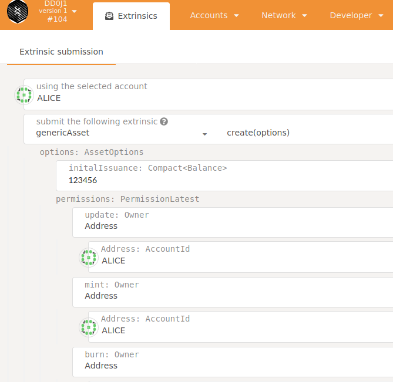
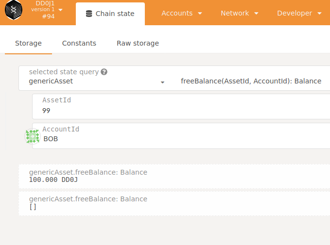

# 2020 09

## 2020-0920

- [opensquare-network/opensquare: Node implementation of OpenSquare Network based on substrate](https://github.com/opensquare-network/opensquare)
- [galacticcouncil/hack.HydraDX-node: Hydra node for Hackusama](https://github.com/galacticcouncil/hack.HydraDX-node)
- [hack.HydraDX-node/Cargo.toml at f2397ea3663a3da80217e2f857406f58ebdd065a · galacticcouncil/hack.HydraDX-node](https://github.com/galacticcouncil/hack.HydraDX-node/blob/f2397ea3663a3da80217e2f857406f58ebdd065a/pallets/amm/Cargo.toml)
- [decouple transaction payment and currency by weichweich · Pull Request #6912 · paritytech/substrate](https://github.com/paritytech/substrate/pull/6912)
- [open-runtime-module-library/currencies at master · open-web3-stack/open-runtime-module-library](https://github.com/open-web3-stack/open-runtime-module-library/tree/master/currencies)
- [Transaction Fees for Economic Security - Substrate Recipes](https://substrate.dev/recipes/fees.html)

## 2020-0917

github 的容器庫有兩種版本，可以無登入公開拉取的容器庫需推到 ghcr.io 

- [Migrating to GitHub Container Registry for Docker images - GitHub Docs](https://docs.github.com/en/packages/getting-started-with-github-container-registry/migrating-to-github-container-registry-for-docker-images)
- [Package substrate](https://github.com/orgs/dltdojo/packages/container/package/substrate)
- [Package substrate · dltdojo/tcpdug](https://github.com/dltdojo/tcpdug/packages/400747)

```
$ docker tag foo ghcr.io/dltdojo/substrate:2.0.0-rc6-1
$ docker push ghcr.io/dltdojo/substrate:2.0.0-rc6-1
```

## 2020-0916

```sh
$ cd chains/sntpl-2.0.0-rc6-1
$ scripts/docker_build.sh
$ docker tag foo docker.pkg.github.com/dltdojo/tcpdug/substrate:2.0.0-rc6-1
$ docker push docker.pkg.github.com/dltdojo/tcpdug/substrate:2.0.0-rc6-1
```

## 2020-0914

外接需要 [Set up Secure WebSocket for Remote Connections · Polkadot Wiki](https://wiki.polkadot.network/docs/en/maintain-wss)，只是要設定 nginx 會佔去機器的 443 port。

支援 Ethereum 的公鏈專案，Avalanche 架構將以太坊支援直接放在 C-Chains 上是直接出廠配備，另外波卡的 Ink! 一直改版未穩定，可直接使用 Ethereum 的 frontier 也是，而 Cosmos ethermint 只出到 0.1.0 版本。 

- [Deploy a Smart Contract - Avalanche Documentation](https://docs.avax.network/v1.0/en/tutorials/deploy-a-smart-contract/)
- [paritytech/frontier: Ethereum compatibility layer for Substrate.](https://github.com/paritytech/frontier)
- [Acala Unveils Smart Contracts and Ethereum Compatibility for Polkadot DeFi | by Dan Reecer | Acala Network | Sep, 2020 | Medium](https://medium.com/acalanetwork/acala-unveils-smart-contracts-and-ethereum-compatibility-for-polkadot-defi-588b3891e53d)
- [Release v0.1.0 · ChainSafe/ethermint](https://github.com/ChainSafe/ethermint/releases/tag/v0.1.0)

## 2020-0913

dev chain sntpl-2.0.0-rc6-1 (DD0J1)

目前建立平行鏈  實做多資產的方式採用整合 [pallet-generic-asset](https://github.com/paritytech/substrate/tree/master/frame/generic-asset) 方式，修改的部份 [dev testnet dd0j1 with pallet-generic-assets · dltdojo/tcpdug@18ba9d5](https://github.com/dltdojo/tcpdug/commit/18ba9d5c309f0c3ab1924c8f47bf433c17d96e24) 請參考。要注意的是目前整個 substrate 的狀態即使到 rc6 還是不固定，如果版本不對，修改支援 pallet-generic-asset 的地方也必須因應改變，等到版本出來會在製作一版。

另一個修改的是 [Substrate_ | Chain Specification](https://www.substrate.io/kb/integrate/chain-spec) 加上測試鏈的名稱與原生幣的單位 DD0J。

測試採用 [Polkadot/Substrate Portal](https://polkadot.js.org/apps/) 來進行，除了瀏覽器不須安裝其他程式，於 Extrinsic submission 執行修改狀態之交易，另外用 Chain state 讀取狀態。





```sh
tcpdug/chains/sntpl-2.0.0-rc6-1$ target/debug/node-template purge-chain --dev
tcpdug/chains/sntpl-2.0.0-rc6-1$ target/debug/node-template --dev
2020-09-13 16:01:45.285 main WARN sc_cli::commands::run_cmd  Running in --dev mode, RPC CORS has been disabled.
2020-09-13 16:01:45.285 main INFO sc_cli::runner  Substrate Node
2020-09-13 16:01:45.285 main INFO sc_cli::runner  ✌️  version 2.0.0-rc6-75c8517-x86_64-linux-gnu
2020-09-13 16:01:45.285 main INFO sc_cli::runner  ❤️  by Substrate DevHub <https://github.com/substrate-developer-hub>, 2017-2020
2020-09-13 16:01:45.285 main INFO sc_cli::runner  📋 Chain specification: DD0J1
2020-09-13 16:01:45.285 main INFO sc_cli::runner  🏷  Node name: humorous-mark-0633
2020-09-13 16:01:45.285 main INFO sc_cli::runner  👤 Role: AUTHORITY
2020-09-13 16:01:45.285 main INFO sc_cli::runner  💾 Database: RocksDb at /home/foo/.local/share/node-template/chains/dev/db
2020-09-13 16:01:45.285 main INFO sc_cli::runner  ⛓  Native runtime: node-template-1 (node-template-1.tx1.au1)
2020-09-13 16:01:45.578 main INFO sc_service::client::client  🔨 Initializing Genesis block/state (state: 0x8acb…319b, header-hash: 0x29fd…0203)
2020-09-13 16:01:45.580 main INFO afg  👴 Loading GRANDPA authority set from genesis on what appears to be first startup.
2020-09-13 16:01:45.732 main INFO sc_consensus_slots  ⏱  Loaded block-time = 6000 milliseconds from genesis on first-launch
2020-09-13 16:01:45.734 main INFO sub-libp2p  🏷  Local node identity is: 12D3KooWEXv1Uycg2JAfPF8W5517vd3E3i4QcqMUUCCMGyNvvGvp (legacy representation: QmXHs2s7QTY6zGhehnQBaaqb3ZyDZjKHEzmiJK1333P3Wf)
2020-09-13 16:01:45.941 main INFO sc_service::builder  📦 Highest known block at #0
2020-09-13 16:01:45.942 tokio-runtime-worker INFO substrate_prometheus_endpoint::known_os  〽 Prometheus server started at 127.0.0.1:9615
2020-09-13 16:01:48.142 tokio-runtime-worker INFO sc_basic_authorship::basic_authorship  🙌 Starting consensus session on top of parent 0x29fd8c02b8245939800299eb5f05b6be53bc08a4038e7a6fa218646852f10203
2020-09-13 16:01:48.241 tokio-blocking-driver INFO sc_basic_authorship::basic_authorship  🎁 Prepared block for proposing at 1 [hash: 0x0ddbf622c96a0505999e1bee913986b75d95da4f2d3b6bd5601487e662500789; parent_hash: 0x29fd…0203; extrinsics (1): [0x4c72…5fde]]
2020-09-13 16:01:48.316 tokio-runtime-worker INFO sc_consensus_slots  🔖 Pre-sealed block for proposal at 1. Hash now 0xb247b277111ed2826d8f073fac6aa48cf4327a949e9297050aeeb17ae0a88c04, previously 0x0ddbf622c96a0505999e1bee913986b75d95da4f2d3b6bd5601487e662500789.
2020-09-13 16:01:48.317 tokio-runtime-worker INFO substrate  ✨ Imported #1 (0xb247…8c04)
2020-09-13 16:01:50.947 tokio-runtime-worker INFO substrate  💤 Idle (0 peers), best: #1 (0xb247…8c04), finalized #0 (0x29fd…0203), ⬇ 0 ⬆ 0
2020-09-13 16:01:54.080 tokio-runtime-worker INFO sc_basic_authorship::basic_authorship  🙌 Starting consensus session on top of parent 0xb247b277111ed2826d8f073fac6aa48cf4327a949e9297050aeeb17ae0a88c04
2020-09-13 16:01:54.084 tokio-blocking-driver INFO sc_basic_authorship::basic_authorship  🎁 Prepared block for proposing at 2 [hash: 0xd820b547f6c22d061710424b35d913e80433c3d33dbfc6a4df9266e4e4dabb5b; parent_hash: 0xb247…8c04; extrinsics (1): [0x6389…247c]]
2020-09-13 16:01:54.158 tokio-runtime-worker INFO sc_consensus_slots  🔖 Pre-sealed block for proposal at 2. Hash now 0x1fcfffdfaa78fba345483cbd57c333fefb066d61bcefcb180f65d64cf14d0002, previously 0xd820b547f6c22d061710424b35d913e80433c3d33dbfc6a4df9266e4e4dabb5b.
2020-09-13 16:01:54.159 tokio-runtime-worker INFO substrate  ✨ Imported #2 (0x1fcf…0002)
2020-09-13 16:01:55.948 tokio-runtime-worker INFO substrate  💤 Idle (0 peers), best: #2 (0x1fcf…0002), finalized #0 (0x29fd…0203), ⬇ 0 ⬆ 0
2020-09-13 16:02:00.086 tokio-runtime-worker INFO sc_basic_authorship::basic_authorship  🙌 Starting consensus session on top of parent 0x1fcfffdfaa78fba345483cbd57c333fefb066d61bcefcb180f65d64cf14d0002
2020-09-13 16:02:00.092 tokio-blocking-driver INFO sc_basic_authorship::basic_authorship  🎁 Prepared block for proposing at 3 [hash: 0x310c6457f43aad2d9dcb5e647d54c69806bdbbc55c3137e162ed1e3b67e99588; parent_hash: 0x1fcf…0002; extrinsics (1): [0x578f…adba]]
2020-09-13 16:02:00.172 tokio-runtime-worker INFO sc_consensus_slots  🔖 Pre-sealed block for proposal at 3. Hash now 0x0d8b308561d6986fab59870aed55062f8aee027609fd924edeebd196d35383d0, previously 0x310c6457f43aad2d9dcb5e647d54c69806bdbbc55c3137e162ed1e3b67e99588.
2020-09-13 16:02:00.173 tokio-runtime-worker INFO substrate  ✨ Imported #3 (0x0d8b…83d0)
2020-09-13 16:02:00.948 tokio-runtime-worker INFO substrate  💤 Idle (0 peers), best: #3 (0x0d8b…83d0), finalized #0 (0x29fd…0203), ⬇ 0 ⬆ 0
2020-09-13 16:02:05.951 tokio-runtime-worker INFO substrate  💤 Idle (0 peers), best: #3 (0x0d8b…83d0), finalized #1 (0xb247…8c04), ⬇ 0 ⬆ 0
2020-09-13 16:02:06.082 tokio-runtime-worker INFO sc_basic_authorship::basic_authorship  🙌 Starting consensus session on top of parent 0x0d8b308561d6986fab59870aed55062f8aee027609fd924edeebd196d35383d0
2020-09-13 16:02:06.087 tokio-blocking-driver INFO sc_basic_authorship::basic_authorship  🎁 Prepared block for proposing at 4 [hash: 0xf1210a9be44be3c3834bb1230fd23e38478f86b1bdcb53d8c6148caffa3ba9a7; parent_hash: 0x0d8b…83d0; extrinsics (1): [0xcf37…b69a]]
2020-09-13 16:02:06.161 tokio-runtime-worker INFO sc_consensus_slots  🔖 Pre-sealed block for proposal at 4. Hash now 0x65c9786710a5086451ff83d003cc1e31d182c2b703900825473e44c3354377fb, previously 0xf1210a9be44be3c3834bb1230fd23e38478f86b1bdcb53d8c6148caffa3ba9a7.
2020-09-13 16:02:06.163 tokio-runtime-worker INFO substrate  ✨ Imported #4 (0x65c9…77fb)
2020-09-13 16:02:10.952 tokio-runtime-worker INFO substrate  💤 Idle (0 peers), best: #4 (0x65c9…77fb), finalized #2 (0x1fcf…0002), ⬇ 0 ⬆ 0
2020-09-13 16:02:12.114 tokio-runtime-worker INFO sc_basic_authorship::basic_authorship  🙌 Starting consensus session on top of parent 0x65c9786710a5086451ff83d003cc1e31d182c2b703900825473e44c3354377fb

```


## 2020-0912

- chains/sntpl-2.0.0-rc6-1 從 [Release v2.0.0-rc6+1 · substrate-developer-hub/substrate-node-template · GitHub](https://github.com/substrate-developer-hub/substrate-node-template/releases/tag/v2.0.0-rc6%2B1) 下載。


### pallet-generic-asset

- [Search · pallet-generic-asset](https://github.com/search?l=TOML&o=desc&q=pallet-generic-asset&s=indexed&type=Code)
- [definex/lib.rs at 8d039864767909f555ba67090c5b8dc0cc7c760c · y2labs-0sh/definex](https://github.com/y2labs-0sh/definex/blob/8d039864767909f555ba67090c5b8dc0cc7c760c/pallets/deposit-loan/src/lib.rs#L101)
- [tcp_server/lib.rs at 70330f2e3562d437a8457947276ec3320f3ed2e1 · TingALin/tcp_server](https://github.com/TingALin/tcp_server/blob/70330f2e3562d437a8457947276ec3320f3ed2e1/substrate-node-template-master/pallets/erc20/src/lib.rs#L14)

### pallet-uniswap

- [lsaether/pallet-swaps: A port of Uniswap to use Substrate.](https://github.com/lsaether/pallet-swaps)
- [JesseAbram/sub_swap](https://github.com/JesseAbram/sub_swap)
- [uniswap-solidity/UniswapExchange.sol at master · PhABC/uniswap-solidity](https://github.com/PhABC/uniswap-solidity/blob/master/contracts/uniswap/UniswapExchange.sol)
- [解析 DeFi 項目《Uniswap》（一）Uniswap 是什麼？ | by 吳冠融 Roger Wu | Taipei Ethereum Meetup | Medium](https://medium.com/taipei-ethereum-meetup/defi-uniswap-1-e36db975e4ae)

